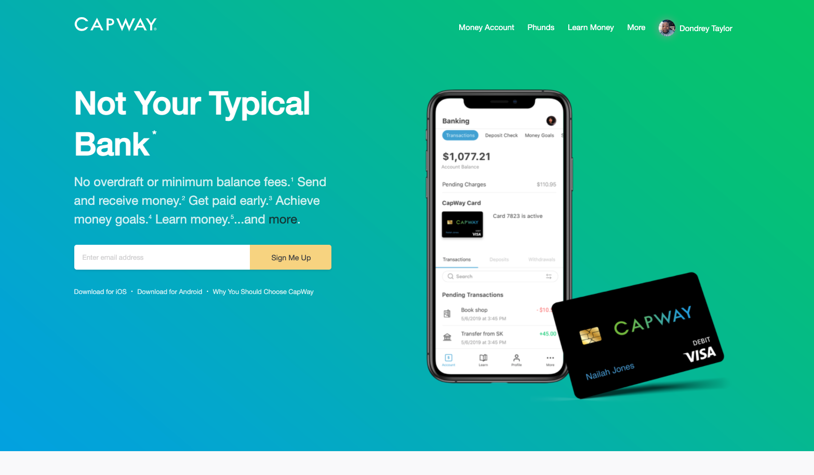
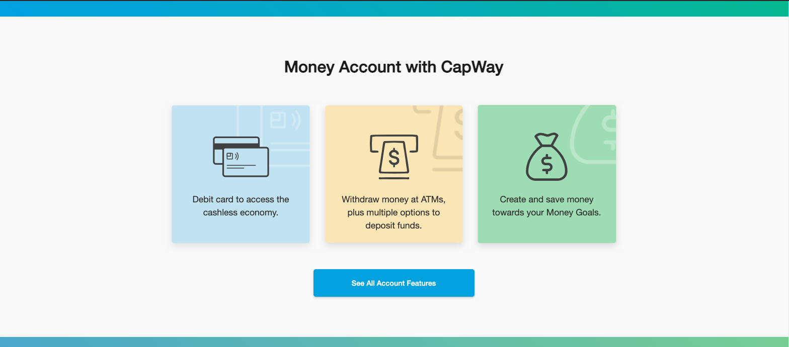
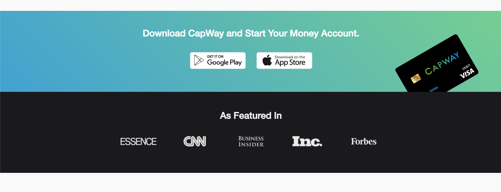
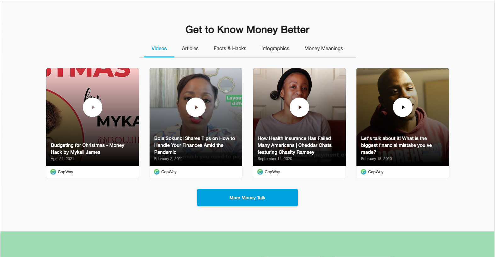
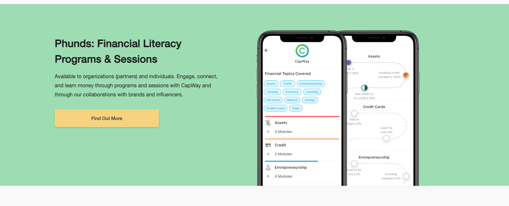
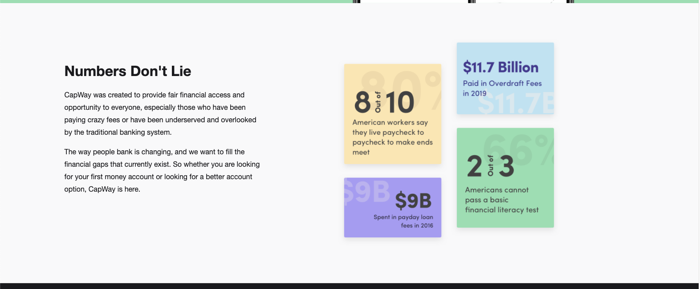
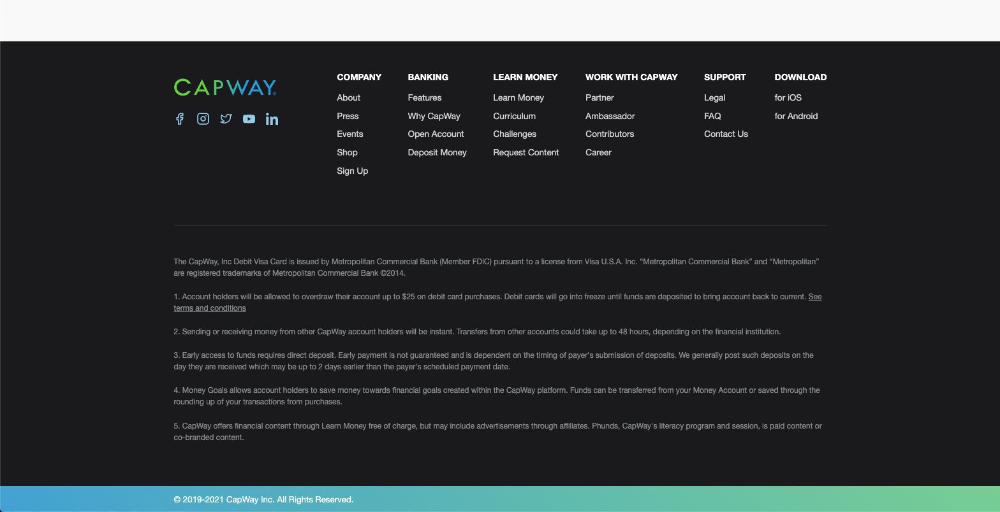

Recreate CapWay's landing page using SASS, JS, and HTML. All assets for the site will be provided.

## Requirements
- HTML should not be the same as the live site nor https://web.dev.cpwys.co. Please use different tags (or at least identifiers when possible) and markup structure. Outside of similar SASS for certain elements, the page structure should be different.
- Should be responsive down to at least 375px width
- Use Helvetica Neue for all fonts. Use the weights regular, medium, or bold in accordance with the designs provided.
- Colors should match design including gradients (refer to https://web.dev.cpwys.co for gradient css)
- You do not have to make any links work. Set all links to "javascript:void(0);"
- For the input field that appears in the first section, make it so that entering in an email and submitting clears the field.
- Use `background-image` to set all images instead of the  tag. Enter image should be set to fit within the tag that you are using to set the background to.
- In the Get to Know Money Better section, make it so that clicking on each of the tabs changes the media below. Using xhr (or any wrapper around xhr like jQuery), make an API call to https://gateway.dev.cpwys.co/api/v1/content/fetch/learnmoney to pull the corresponding media for each tab. Only use the first 4 of each category. Use the the `thumbnail_url` property to set the image of each card.

## How to submit
- Fork this repository on GitHub
- Occassionally commit changes using GIT while developing
- When you are ready to submit, open a pull request with this respository

## Previews

